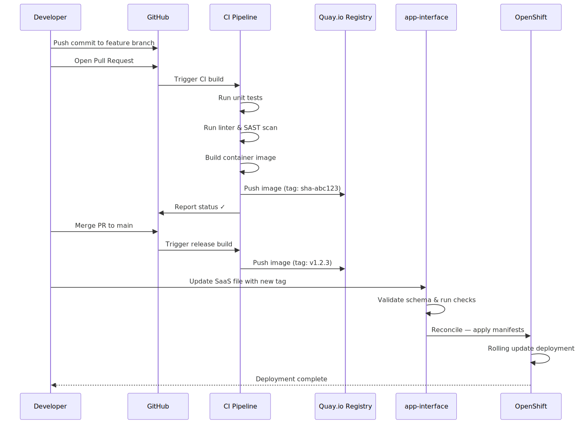

# Network Topology — GovCloud Environment

This page documents the fictional network architecture for our OpenShift clusters running in AWS GovCloud.

## High-Level Network Overview

## Service Mesh Traffic Flow

This diagram shows how requests flow through the service mesh within the OpenShift cluster.

## Deployment Pipeline

The CI/CD pipeline from code commit to production deployment.

## Cluster Node Architecture

## Disaster Recovery Architecture

This shows the failover setup between primary and DR regions.

## Monitoring & Alerting Flow

## Network Security Zones

## Related Pages

- [Architecture Overview](overview.md) — system components and data flow
- [Deployment Architecture](deployment.md) — CI/CD and scaling
- [Incident Response](../runbooks/incident-response.md) — what to do when things break
